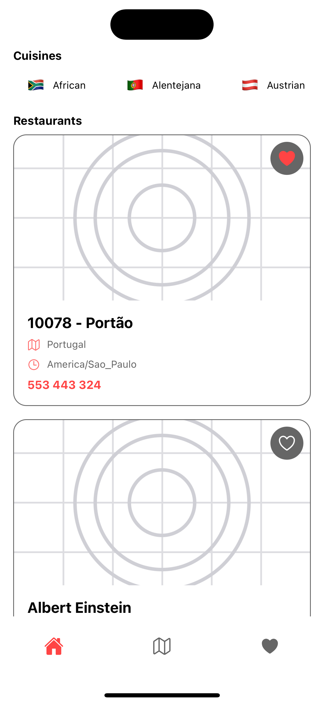
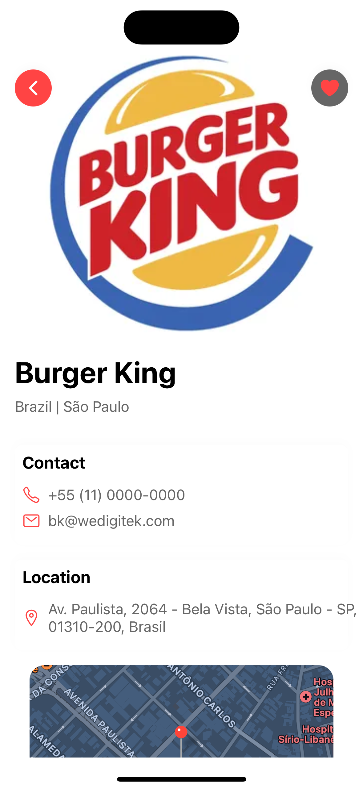
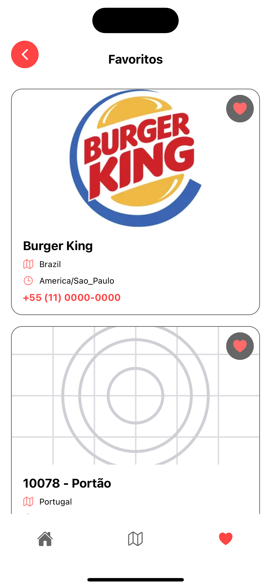
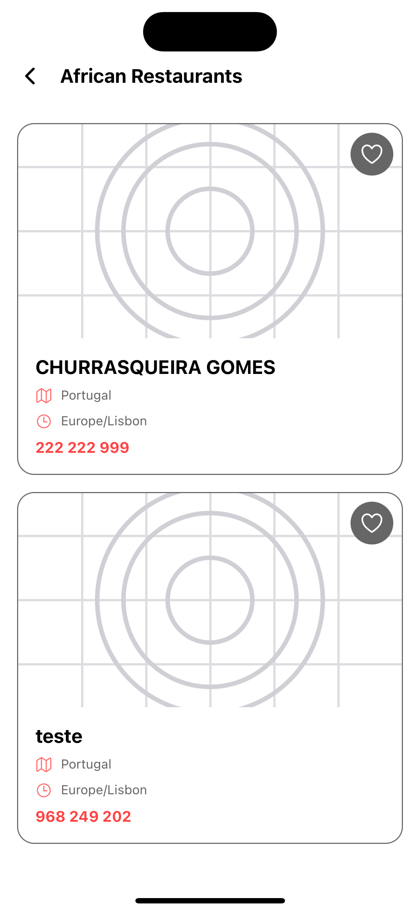
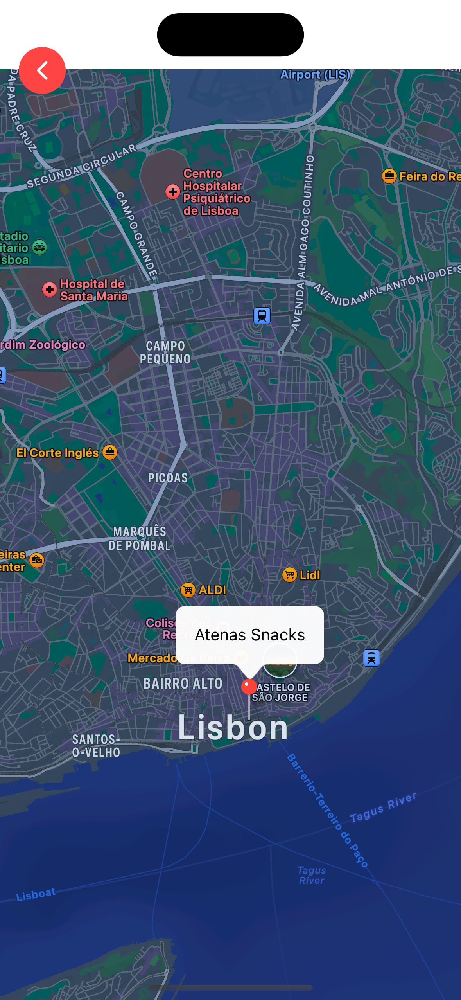

# Restaurant App

A modern React Native application for discovering and managing favorite restaurants. Built with TypeScript and following best practices for code organization and performance.

## 🎯 Project Goals

- Create a user-friendly interface for browsing restaurants
- Implement country-based filtering
- Allow users to manage their favorite restaurants
- Demonstrate best practices in React Native development
- Showcase clean architecture and code organization

## 🚀 Features

- **Restaurant Discovery**: Browse through a curated list of restaurants
- **Country Filtering**: Filter restaurants by country with an intuitive category selector
- **Favorites Management**: Add/remove restaurants to/from favorites
- **Detailed Information**: View comprehensive restaurant details including:
  - Location
  - Contact information
  - Image
  - Address details
- **Infinite Scrolling**: Load more restaurants as you scroll
- **Responsive Design**: Optimized for various screen sizes
- **Performance Optimized**: Implemented with React best practices

## 🏗 Project Structure

```
mobile-challenge/
├── App.tsx              # Main application entry point
├── app/                 # Core application code
│   ├── components/      # Reusable UI components
│   ├── context/         # React Context providers
│   ├── screens/         # Main application screens
│   ├── theme/           # Styling and theming
│   └── types/           # TypeScript type definitions
├── assets/              # Static assets
├── screenshots/         # Application screenshots
├── babel.config.js      # Babel configuration
├── app.json             # Expo configuration
├── package.json         # Dependencies and scripts
└── tsconfig.json        # TypeScript configuration
```

## 🎨 Architecture Decisions

### Component Structure
- **Atomic Design**: Components are built following atomic design principles
- **Separation of Concerns**: Each component has its own styles and logic
- **Reusability**: Components are designed to be reusable across the app

### State Management
- **Context API**: Used for managing global state (favorites)
- **Custom Hooks**: Encapsulate complex logic and state management
- **Memoization**: Optimized performance with React.memo and useCallback

### Styling
- **Theme System**: Centralized theme for consistent styling
- **Responsive Design**: Flexible layouts that work across devices
- **Shadow Utilities**: Consistent elevation and depth across the app

## 📱 Screenshots

### Restaurant List

*Main screen showing the list of restaurants with country filtering*

### Restaurant Details

*Detailed view of a restaurant with all information*

### Favorites

*User's favorite restaurants with quick actions*

### Country Filtering

*Country-based filtering in action*

### Map

*Map with the restaurants locations*

## 🛠 Getting Started

### Prerequisites
- Node.js (v14 or later)
- npm or yarn
- React Native development environment set up
- Expo Go SDK 50

### Installation

1. Clone the repository:
```bash
git clone https://github.com/fabianacostagloria/restaurant-app.git
```

2. Install dependencies:
```bash
cd restaurant-app
yarn install
```

3. Start the development server:
```bash
yarn start
```

4. Run on iOS:
```bash
yarn ios
```

5. Run on Android:
```bash
yarn android
```

## 📦 Dependencies

- React Native
- TypeScript
- React Navigation


## ⚡ Performance Optimizations

### Component Optimizations
- **Memoization**: Used React.memo for pure components to prevent unnecessary re-renders
- **useCallback**: Optimized callback functions to maintain referential equality
- **Lazy Loading**: Implemented lazy loading for images and data
- **Virtualization**: Used FlatList for efficient list rendering

### State Management
- **Context Optimization**: Minimized context updates to prevent unnecessary re-renders
- **Local State**: Used local state for component-specific data
- **Custom Hooks**: Encapsulated complex state logic in custom hooks

### Image Handling
- **Image Caching**: Implemented image caching for faster loading
- **Image Optimization**: Used appropriate image sizes and formats
- **Progressive Loading**: Implemented progressive image loading for better UX

### Data Management
- **Pagination**: Implemented infinite scroll with efficient data fetching
- **Data Caching**: Cached API responses for faster subsequent loads
- **Debouncing**: Implemented debouncing for search and filter operations

### Code Splitting
- **Component Structure**: Organized components for better code splitting
- **Dynamic Imports**: Used dynamic imports for larger features
- **Tree Shaking**: Enabled tree shaking for smaller bundle size

## 🔨 Development Process & Best Practices

### Code Organization
- **Feature-First Structure**: Organized code by features rather than types
- **Consistent Naming**: Following a clear naming convention across the project
- **Type Safety**: Strict TypeScript configuration for better type safety
- **Clean Code**: Following SOLID principles and clean code practices

### Component Development
- **Single Responsibility**: Each component has a single, well-defined purpose
- **Props Interface**: Clear interface definitions for component props
- **Error Boundaries**: Implemented error boundaries for graceful error handling
- **Accessibility**: Following React Native accessibility guidelines

### Styling Approach
- **Theme-Based**: Centralized theme for consistent styling
- **Responsive**: Flexible layouts that adapt to different screen sizes
- **Style Organization**: Separated styles from component logic
- **Design System**: Consistent use of spacing, typography, and colors
